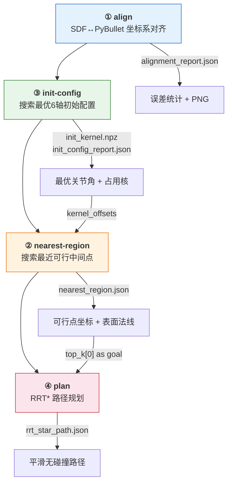
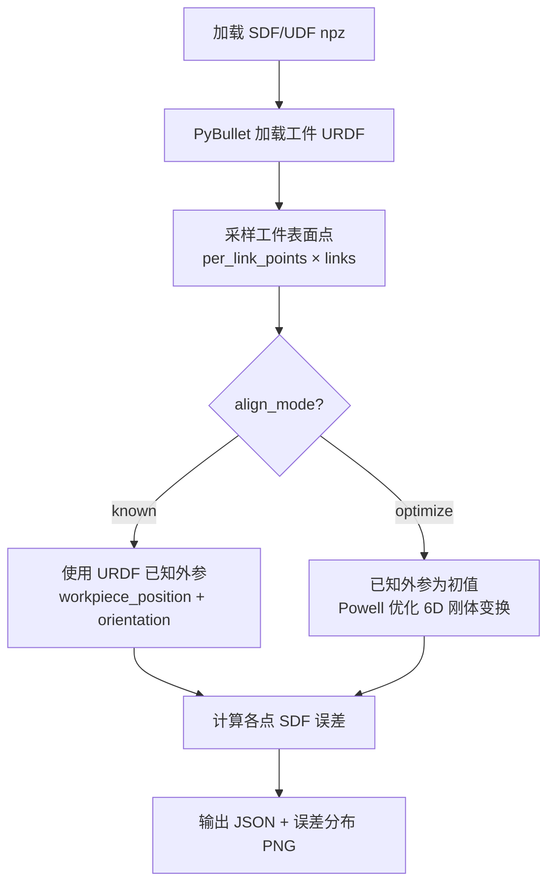
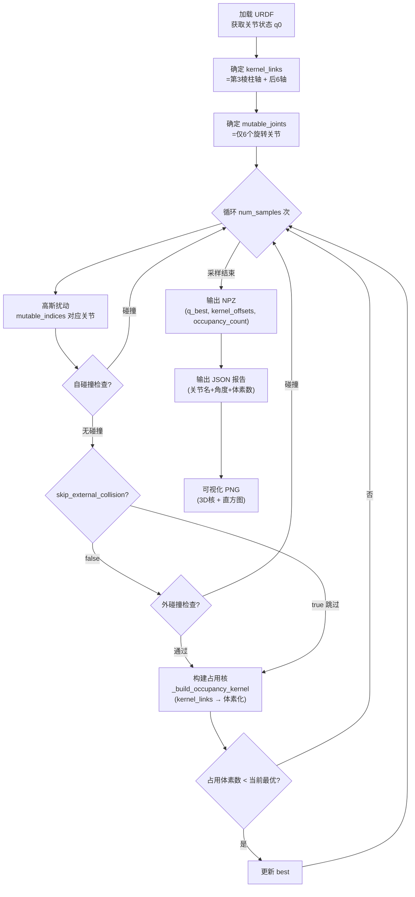
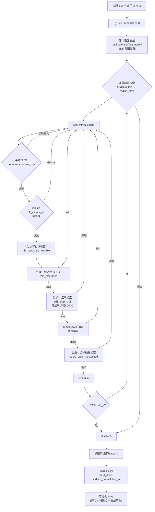
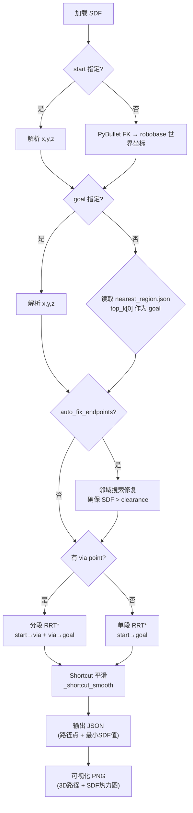

# SDF Integration Experiments 流程图

## 总体流水线



## ① align — 坐标系对齐



## ③ init-config — 最优初始配置搜索



## ② nearest-region — 最近可行中间点搜索



## ④ plan — RRT* 路径规划



## 核心性能优化：向量化 SDF 查询

```mermaid
flowchart LR
    Q1["field.query(pts)"] --> Q2{pts.ndim == 2?}
    Q2 -->|单点 shape=(3,)| Q3["query_single<br/>逐点三线性插值"]
    Q2 -->|批量 shape=(N,3)| Q4["query_batch_vectorized<br/>NumPy 向量化"]
    Q4 --> Q5["一次性计算 N 个体素索引<br/>ix0, iy0, iz0"]
    Q5 --> Q6["高级索引取 8 角值<br/>grid[ix0, iy0, iz0] ..."]
    Q6 --> Q7["向量化三线性插值<br/>返回 (N,) float32"]
```
